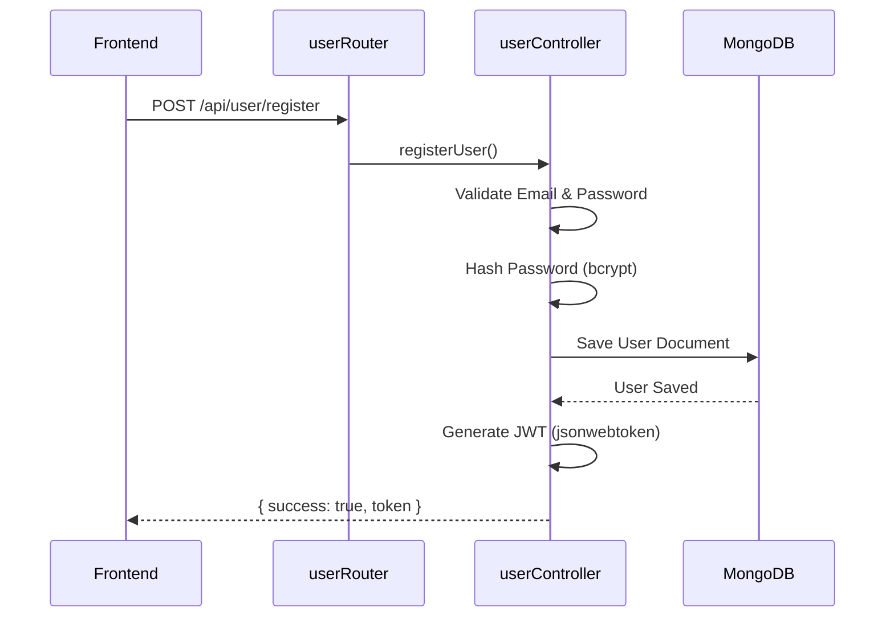
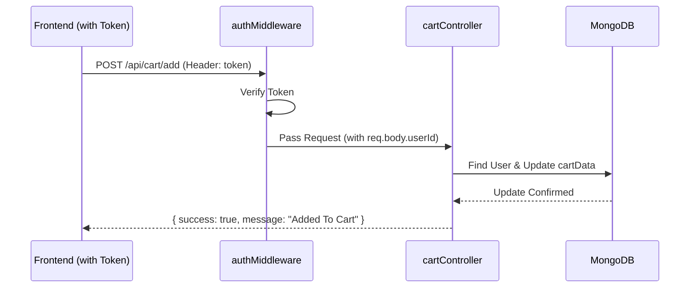

# Backend Documentation & Data Flow

This document provides a comprehensive guide on how to set up the backend and explains how data flows through the application.

## 🚀 Backend Setup Steps

Follow these steps to get the backend server up and running:

1.  **Navigate to the backend directory**:
    ```bash
    cd backend
    ```

2.  **Install Dependencies**:
    Make sure you have all the required packages installed.
    ```bash
    npm install
    ```

3.  **Configure Environment Variables**:
    Open the `.env` file in the `backend/` directory and fill in your actual credentials:
    -   `MONGODB_URI`: Your MongoDB connection string.
    -   `JWT_SECRET`: A long, random string used for signing tokens.
    -   `STRIPE_SECRET_KEY`: Your Stripe secret key for processing payments.

4.  **Start the Server**:
    Run the server using nodemon for automatic restarts.
    ```bash
    npm run server
    ```
    The server should now be running on `http://localhost:4000` (or the port specified in `.env`).

---

## 🔄 Data Flow Overview

The backend follows a **Model-View-Controller (MVC)** pattern (without the View, as it's an API).

### 1. Request Handling
-   **Routes**: Every request starts in `server.js`, which routes it to specific routers (e.g., `foodRoutes.js`, `userRoute.js`).
-   **Middleware**: Before reaching the controller, some requests pass through `auth.js` middleware to verify the JWT token and extract the `userId`.

### 2. User Authentication Flow


### 3. Cart Management Flow (Protected)


### 4. Order & Payment Flow (Stripe)
1.  **Place Order**: Frontend sends cart items and address. Controller creates an `orderModel` entry (payment: false) and generates a Stripe Checkout session.
2.  **Payment**: User completes payment on Stripe's hosted page.
3.  **Verify**: Stripe redirects back to the frontend (`/verify`). The frontend calls `/api/order/verify`.
4.  **Confirmation**: The backend checks the status and updates `payment: true` in the database.

---

## 📁 Directory Structure

-   `config/`: Database connection configuration.
-   `controllers/`: Application logic (Auth, Cart, Food, Orders).
-   `middleware/`: Request filters (Authentication).
-   `routes/`: URL endpoints definition.
-   `uploads/`: Static storage for food images.
-   `utils/`: Helper functions (Response handlers).
-   `services/`: Business logic components (Stripe Service).
-   `config/`: Configuration (DB and Constants).

---

## 🏗️ Modular Components ("Understandings")

To make the backend professional and easy to maintain, I've implemented several **Modular Components**:

### 1. Response Utility (`utils/response.js`)
Instead of manually writing JSON responses everywhere, we use a single component to ensure every API call returns the same structure:
```javascript
{ "success": true, "message": "...", "data": ... }
```

### 2. Admin Security Component (`middleware/adminAuth.js`)
A dedicated middleware that ensures only users with `isAdmin: true` can access sensitive routes like viewing all orders or updating delivery statuses.

### 3. Modular Razorpay Component (`services/razorpayService.js`)
All Razorpay-related logic (order creation, currency conversion) is encapsulated here. This makes the `orderController` much cleaner and the payment flow easier to understand.

### 4. Constants Configuration (`config/constants.js`)
Centralized place for all global settings like `FRONTEND_URL` and `EXCHANGE_RATE`, making it easy to change them for production.


Backend Implementation Walkthrough
I have successfully completed the backend implementation for the food delivery application.

Key Accomplishments


1. User Authentication

Implemented a robust authentication system using JWT and bcrypt.

Registration: Validates email and password strength, hashes passwords, and returns a token.
Login: Verifies credentials and returns a session token.
Model: 
userModel.js


2. Cart Management

Enabled persistent shopping carts for authenticated users.

Functionality: Users can add items, remove items, and retrieve their cart state.
Security: All cart routes are protected by 
authMiddleware
.
Controller: 
cartController.js


3. Order Processing

Integrated Stripe for secure payments and simplified order management.

Stripe Integration: Generates checkout sessions for the frontend.
Verification: webhook-style endpoint to verify payment success.
Admin Features: Endpoints to list all orders and update delivery status.
Controller: 
orderController.js


4. Infrastructure & Integration

Server: Registered all new routes in 
server.js
.
Database: Updated 
db.js
 to use environment variables.
Config: Setup a template 
.env
 file with required keys.
Next Steps for You
IMPORTANT

Please update the JWT_SECRET and STRIPE_SECRET_KEY in your 
backend/.env
 file with your actual keys to enable authentication and payments.

 

# To start the server
cd backend
npm run server
The backend is now ready to support the frontend features you are building!